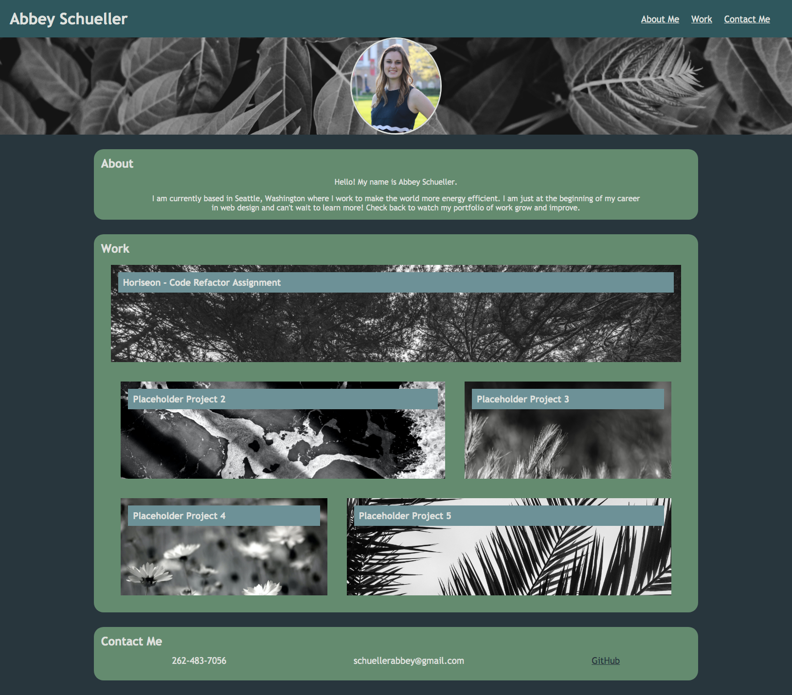

# Portfolio

## Description
The goal of this assignment was to expand on my existing portfolio. It includes updated styling and links to other projects. 

## Installation

Visit this link to view my portfolio page: https://abbeyschu.github.io/Portfolio/

## Screenshot of Portfolio

## License 

[MIT](https://github.com/abbeyschu/homework2_AS/raw/main/assets/license.txt)
